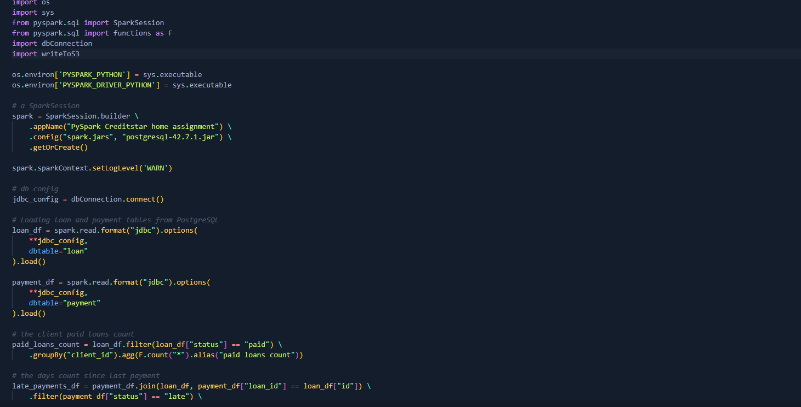
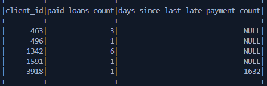

### Home Assignment
As a senior data engineer, one of your responsibilities will be to contribute to the
development of our inhouse data services. One of them is data streaming from replicas of
operational databases to S3 and making it available for other data services, such as machine
learning models and decision engines. The following task reflects one of the problems that our
data engineering team faces.
- Video
    [](sample_video_how_it_works.mp4)


#### Sub task 1
- S3 configuration it either can be done in AWS platform or can be used Terraform
    - install Terraform with following <a href="https://developer.hashicorp.com/terraform/tutorials/aws-get-started/install-cli " target="_blank">link</a>
    - run following command `terraform init` and `terraform apply`
- I did PostgreSQL in my local pc and I used Docker.
    - install Docker <a href="https://docs.docker.com/engine/install/" target="_blank">link</a>
    - run following command `docker run --name postgresql -e POSTGRES_DB=postgres -e POSTGRES_USER="postgres" -e POSTGRES_PASSWORD=pass -d postgres` and give user name and password, I had used .env for sensitive data.
    And data retrieved with following command `type de_test_task_db_plain_text.sql | psql -d postgres -U postgres`
- For ETL pipeline, I used Spark open-source unified analytics engine for large-scale data processing and I gave config solution for Docker and also, for local Spark config.
    - For Docker run following command to create an image for Spark `docker build -t cluster-apache-spark:3.5.0 .`
    - And run `docker-compose up -d`, it will create two worker and one master node for Spark, for this code in cluster you need to have Python version 3.7.3 because Docker image has 3.7.3 version installation, otherwise code will not work due to incompaliblity.
    - For local Spark config on Windows 11, just follow procudure in this <a href="ttps://medium.com/@ansabiqbal/setting-up-apache-spark-pyspark-on-windows-11-machine-e16b7382624a" target="_blank">link</a> and install Spark version 3.5.0 latest realease.
- After all configurations run `pip install -r requirements.txt` and run `python .\app\streamPipeline.py` or submit to master node 
    ```
    spark-submit \
    --master <master-url> \ 
    streamPipeline.py

    ```


#### Sub task 2
- These two features implemented and created new dataframe
    - client.paid_loans.count - number of previously paid loans for this client.
    - client.days_since_last_late_payment.count - count of days since the last late
    payment done by this client.
    
    
#### Sub task 3
Explain the scalability of your solution. Please explain both horizontal and vertical
scalability. Include a few important pros and cons of the solution.
- `For Horizontal`, we can add more worker nodes to Spark application or more server nodes, it can be done vie Kubernetes, Docker, Cloud, and On-premise. 
    - Pros
        - it will be bring high availability and fault tolerance, it means when one of nodes fails, others will pick job and continue data processing.
        - it will process large volume of data very fast in memory.
    - Cons
        - When adding more machine or worker nodes, it will increase communication between workers and there can be latency.
        - Monotoring all Worker nodes will require more job.

- `For Vertical`, this can be done adding more memory, cpu cores and storage. 
    - Pros
        - Simplicity
        - Low latency
    - Cons
        - when machine fails, whole system will fail


- `In my Solution`
    - Pros
        - It works fast and easy to transform data in spark comparing to Kafka.
    - Cons 
        - I had used spark.read() function instead of spark.readStream() because PostgreSQL jdbc driver does not support streaming, and when using spark.read() it will read all data from DB for performance it is bad but when using streaming it will only consume new entries.

- For perfect solution, I had created an small architecture but I did't use Kafka in my solution due to 8 hours limit.
    - Figure 1 
    - For consuming data Kafa can be used along with Debezium, which Debezium captures data changes from database transaction logs in real-time without impacting database performance and push them as a event to Kafka.
    - For ETL Spark and streaming data to S3.
